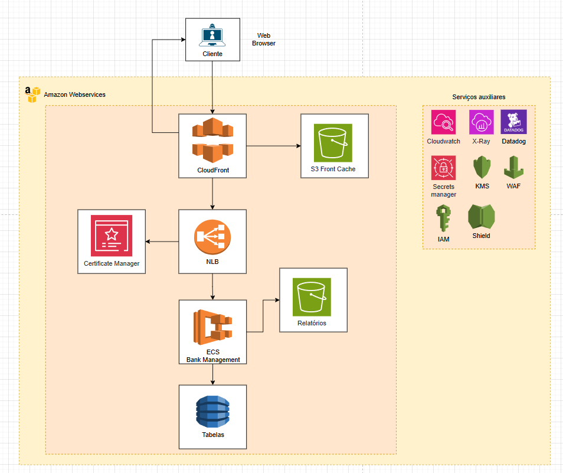

# Case Digital Assets Project — FullStack Backend

This is the backend for the **Case Digital Assets** project (`MichaelCX77/case-digital-assets`).  
Below are instructions to run and understand the project locally with one command.

---

## Solution Diagram

AWS solution diagram ASIS (Draw.io):  
`docs/refinamento/assets/aws_soluction_diagram_asis.png`



---

AWS solution diagram TOBE (Draw.io):  
`docs/refinamento/assets/aws_soluction_diagram_tobe.png`


---

## Prerequisites

- [Node.js (v24.11.1)](https://nodejs.org/)
- [npm](https://www.npmjs.com/)
- **No external database or Docker setup is required.**  
  The project uses **embedded SQLite** via Prisma for local development.

---

## Installation & Setup

1. **Clone the repository:**
   ```bash
   git clone https://github.com/MichaelCX77/case-digital-assets.git
   cd case-digital-assets/backend
   ```

2. **Create or edit your environment file:**
   - Make sure you have a `.env` file in the `backend` folder, with the required settings (database URL, secrets, etc).
   - For development, SQLite is used by default:
     ```
     DATABASE_URL="file:./dev.db"
     ```

---

## Running Locally (Single Command)

Just run:

```bash
npm run setup
```

This script will:
- Install dependencies (`npm install`)
- Apply database migrations (`npm run migrate:deploy`)
- Start the backend in **development mode with hot reload** (`npm run start:dev`)
- Prisma will use the local SQLite database file (`dev.db`).

### Application Port

The API is available on port **3000** by default:
```
http://localhost:3000/
```

### Swagger Documentation

API documentation and testing via Swagger UI:
```
http://localhost:3000/api
```

---

## Security & Middleware

- **CORS** enabled for secure integration with frontends
- **JWT** authentication with custom payloads (using `sub` claim)
- Automatic management of **correlation-id** and **transaction-id** for each request
- **Rate limiting middleware** to prevent abuse
- **Content-Type** validation for payload integrity
- Centralized error handling via global exception filter
- Global **request interceptor** (structured logging)
- Modular architecture: **Repository, Service, Controller**

---

## Logging

Standardized and structured logs are generated — see example:  
`docs/examples/example.log.json`

---

## Request Flow

- All requests are processed by custom middlewares (rate limit, correlation-id, transaction-id, content-type).
- Custom payloads and validation at the controller level.
- Centralized error handling and logging/interception of IN/OUT requests.

---

## Project Structure

- `src/` — Application source code
- `prisma/` — Prisma models and migrations
- `test/` — Unit and end-to-end tests
- `docs/` — Documentation and assets

---

## Useful Scripts

```bash
npm run format     # Format code
npm run lint       # Lint project
npm run test       # Unit tests
npm run test:e2e   # End-to-end tests
npm run start:dev  # Development mode with hot reload
npm run build      # Build for production
npm run start:prod # Run production build
```

---

## Error Handling & Payloads

- Custom payload validation at the controller level
- Centralized error handling via global filter
- Rate limit customizable via environment variables

---

## API Testing Collection

Insomnia collection for API testing is available at:  
`docs/refinamento/Banking Management API - Insomnia.yaml`

---

## Notes

- You do **not** need to configure a local database or Docker. All data is stored in an embedded SQLite file.
- CORS is enabled and can be configured via environment variables.
- Swagger documentation is available at `/api` when running locally.
- All requests are tracked with correlationId, transactionId, and JWT sub claim.
- See the provided logs for examples and troubleshooting.
- See internal documentation and Swagger for full endpoints and business rules.

---