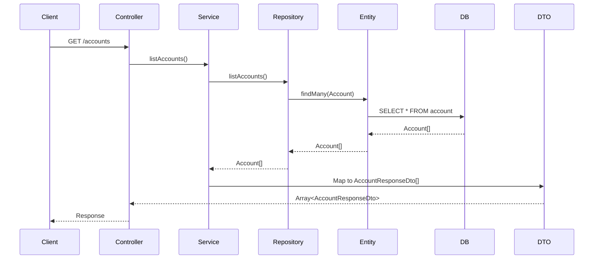

```mermaid
sequenceDiagram
  participant Client
  participant Controller
  participant Service
  participant Repository
  participant Entity
  participant DB
  participant DTO

  Client->>Controller: GET /accounts
  Controller->>Service: listAccounts()
  Service->>Repository: listAccounts()
  Repository->>Entity: findMany(Account)
  Entity->>DB: SELECT * FROM account
  DB-->>Entity: Account[]
  Entity-->>Repository: Account[]
  Repository-->>Service: Account[]
  Service->>DTO: Map to AccountResponseDto[]
  DTO-->>Controller: Array<AccountResponseDto>
  Controller-->>Client: Response
```